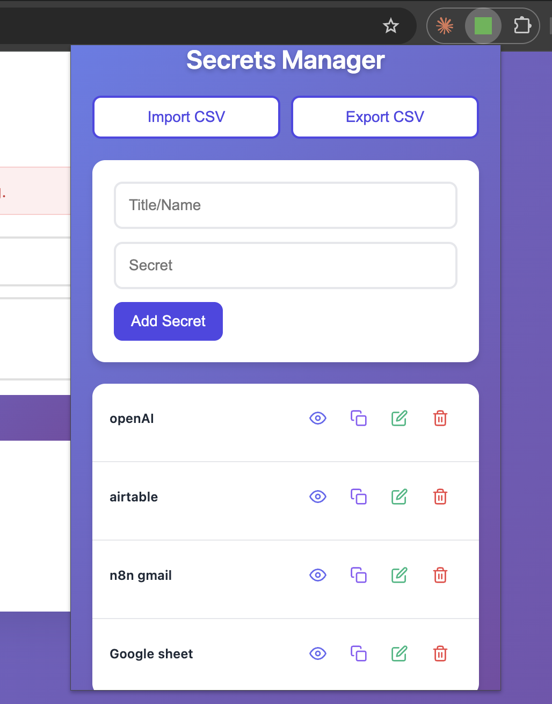

# Secrets Manager Chrome Extension

A Chrome extension for securely storing and managing secrets with CSV import/export functionality.



## Features

- ✅ Add secrets with title and secret value
- ✅ View all stored secrets
- ✅ Edit existing secrets
- ✅ Delete secrets
- ✅ Toggle visibility of secret values (accordion-style expand/collapse)
- ✅ Copy secrets to clipboard with one click
- ✅ Export all secrets to CSV
- ✅ Import secrets from CSV file

## Installation

1. Open Chrome and navigate to `chrome://extensions/`
2. Enable "Developer mode" (toggle in the top right)
3. Click "Load unpacked"
4. Select the `secrets` folder
5. The extension icon should now appear in your Chrome toolbar

## Usage

1. Click the extension icon in your Chrome toolbar
2. Enter a title and secret value in the form
3. Click "Add Secret" to save
4. Use the eye icon to expand/collapse secret values (accordion-style)
5. Click "Edit" to modify a secret
6. Click "Delete" to remove a secret
7. Click "Export CSV" to download all secrets as a CSV file
8. Click "Import CSV" to import secrets from a CSV file

## CSV Format

The CSV file should have the following format:
```csv
Title,Secret
My API Key,sk-1234567890abcdef
Database Password,mySecurePassword123
```

## Icons

The extension includes minimal placeholder icons. For better-looking icons:
- Open `generate-icons.html` in your browser and click each canvas to download proper icons
- Or create your own icons (16x16, 48x48, and 128x128 pixels) and replace the existing icon files

## Privacy & Security

- All secrets are stored locally in your browser using Chrome's storage API
- Data never leaves your device
- No external servers or APIs are used
- Secrets are stored in plain text in Chrome's local storage (be aware of this for sensitive data)

## Development

The extension uses:
- Manifest V3
- Chrome Storage API for data persistence
- Vanilla JavaScript (no frameworks)
